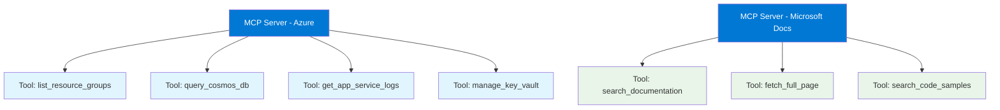
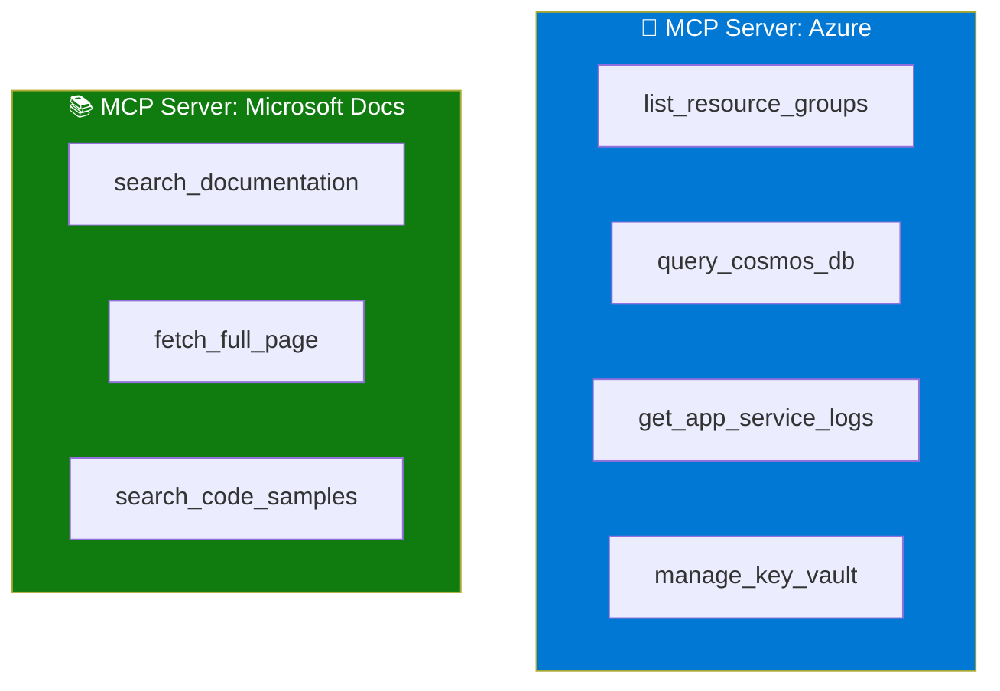
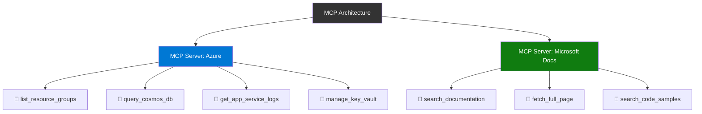
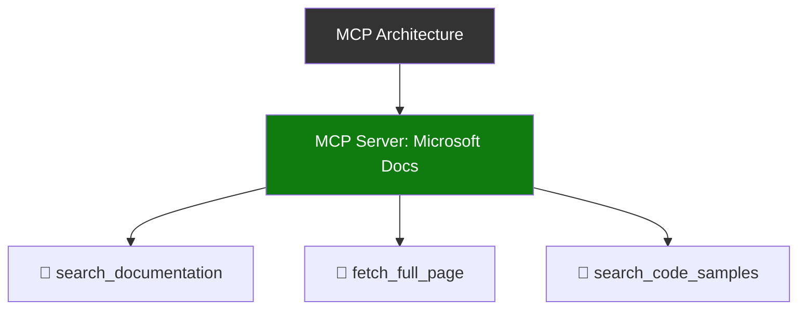

```mermaid
graph TD
    A[MCP Server - Azure] --> B[Tool: list_resource_groups]
    A --> C[Tool: query_cosmos_db]
    A --> D[Tool: get_app_service_logs]
    A --> E[Tool: manage_key_vault]
    
    F[MCP Server - Microsoft Docs] --> G[Tool: search_documentation]
    F --> H[Tool: fetch_full_page]
    F --> I[Tool: search_code_samples]
    
    style A fill:#0078d4,color:#fff
    style F fill:#0078d4,color:#fff
    style B fill:#e1f5fe
    style C fill:#e1f5fe
    style D fill:#e1f5fe
    style E fill:#e1f5fe
    style G fill:#e8f5e8
    style H fill:#e8f5e8
    style I fill:#e8f5e8
```

```mermaid
flowchart TD
    subgraph Azure["🔵 MCP Server: Azure"]
        A1[list_resource_groups]
        A2[query_cosmos_db]
        A3[get_app_service_logs]
        A4[manage_key_vault]
    end
    
    subgraph Docs["📚 MCP Server: Microsoft Docs"]
        B1[search_documentation]
        B2[fetch_full_page]
        B3[search_code_samples]
    end
    
    style Azure fill:#0078d4,color:#fff
    style Docs fill:#107c10,color:#fff

```

```mermaid
graph TD
    Root[MCP Architecture] --> Azure[MCP Server: Azure]
    Root --> Docs[MCP Server: Microsoft Docs]
    
    Azure --> A1[🔧 list_resource_groups]
    Azure --> A2[🔧 query_cosmos_db]
    Azure --> A3[🔧 get_app_service_logs]
    Azure --> A4[🔧 manage_key_vault]
    
    Docs --> B1[🔧 search_documentation]
    Docs --> B2[🔧 fetch_full_page]
    Docs --> B3[🔧 search_code_samples]
    
    style Root fill:#333,color:#fff
    style Azure fill:#0078d4,color:#fff
    style Docs fill:#107c10,color:#fff
```

```mermaid
graph TD
    Root[MCP Architecture] --> Docs[MCP Server: Microsoft Docs]
    
    Docs --> B1[🔧 search_documentation]
    Docs --> B2[🔧 fetch_full_page]
    Docs --> B3[🔧 search_code_samples]
    
    style Root fill:#333,color:#fff
    style Docs fill:#107c10,color:#fff
```
