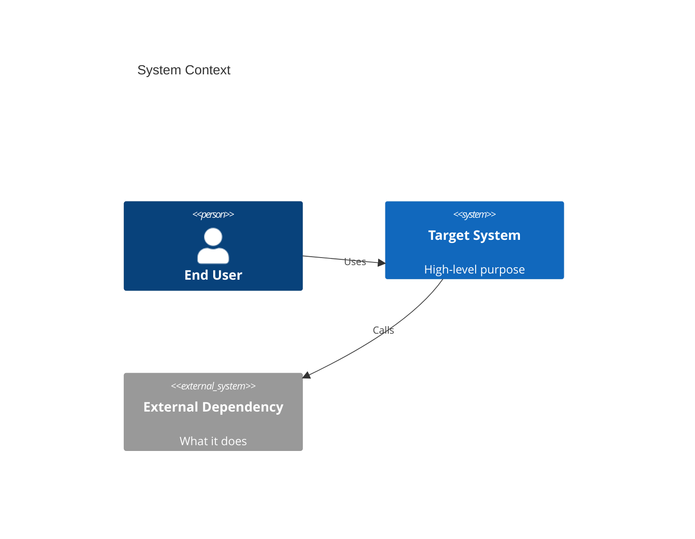
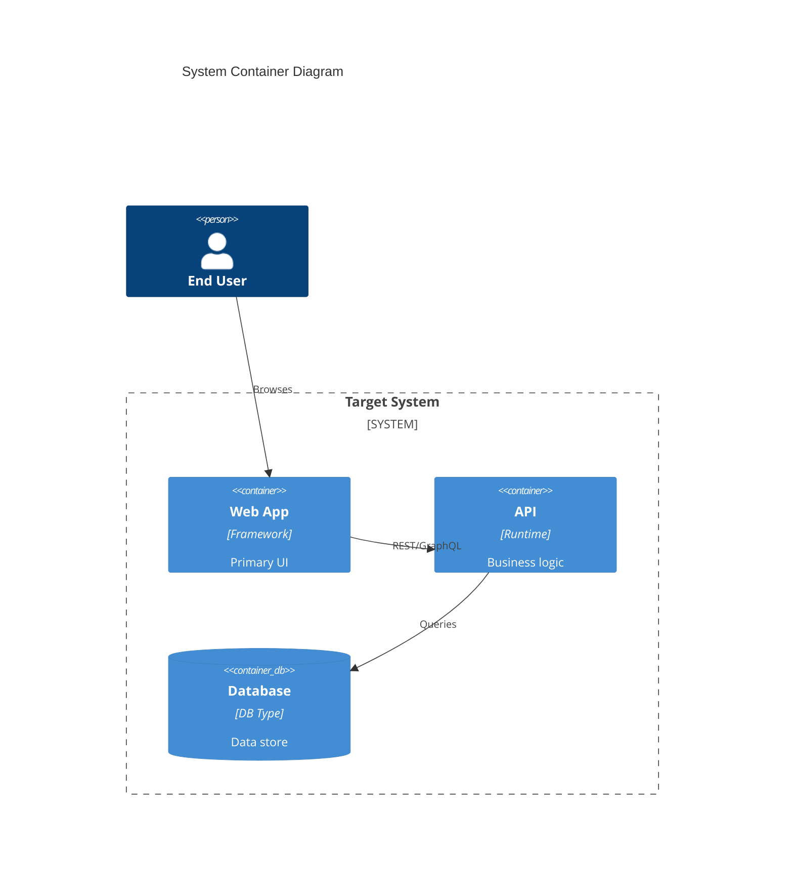

Please update the application documentation to include current-state details and Mermaid C4 diagrams.

Scope

- Audit current repository to reflect the application's present state (features, services, workflows)
- Update README.md (or create /docs/overview.md if preferred) with:
  - Executive summary of the system
  - Technology stack and high-level architecture
  - Clear build/run instructions if missing
- Add Mermaid C4 diagrams (as code blocks), at minimum:
  - C4 Context diagram (C1)
  - C4 Container diagram (C2)
  - (Optional) C4 Component diagram (C3) for the most critical service/module

Acceptance Criteria

- README.md (or docs/overview.md) contains:
  - Accurate description of current app state
  - At least one Mermaid code block for C1 and C2
  - Links to any deeper documentation or diagrams
- Diagrams render correctly in supported viewers (e.g., GitHub Mermaid support)
- Any assumptions or unknowns are clearly called out with TODOs or questions

References

- Use Mermaid C4 syntax patterns; example stubs below for convenience.

Examples (stubs to customize)

Notes

- If the repo contains multiple services, include per-service sections and repeat C2 as needed.
- Keep diagrams small and focused; link to deeper C3/C4 as the architecture evolves.
